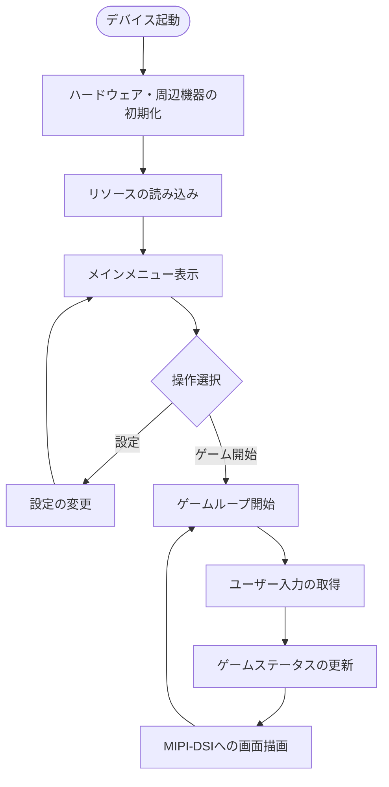
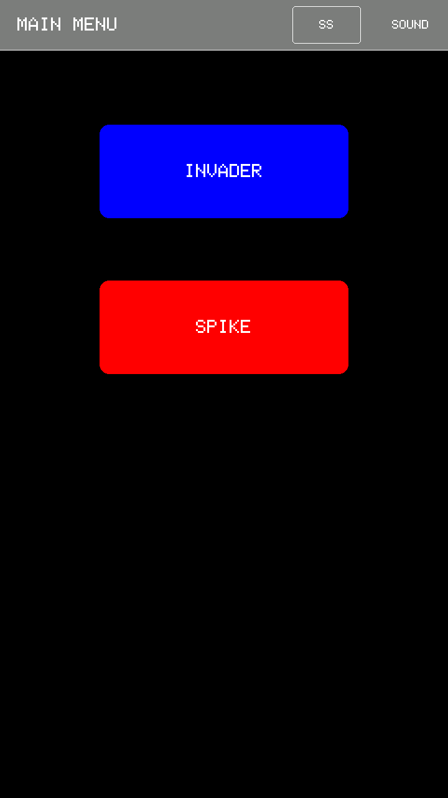
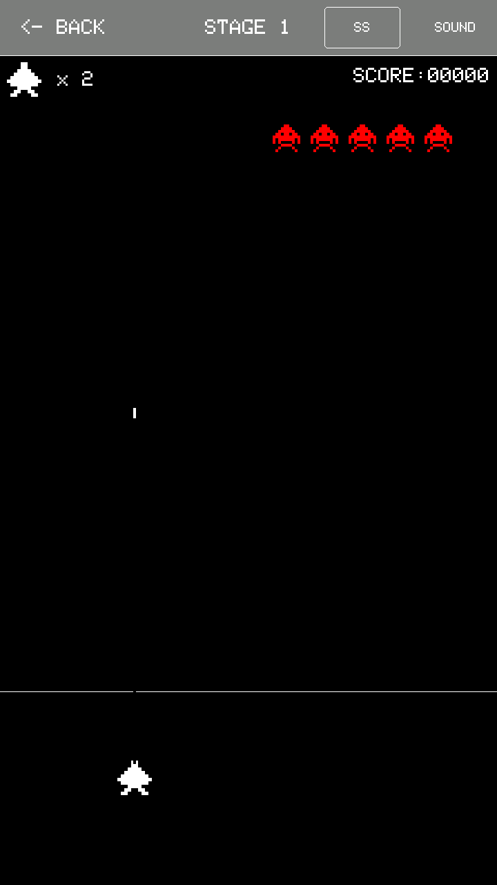
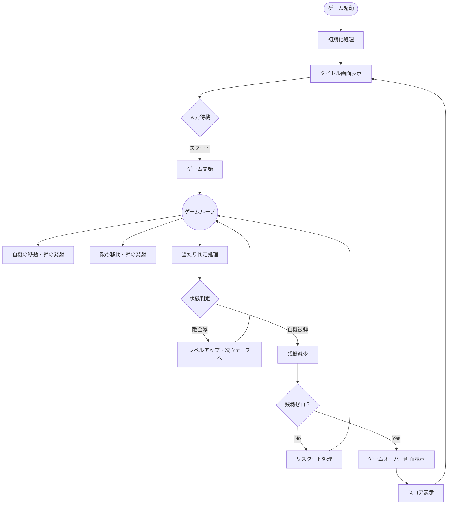
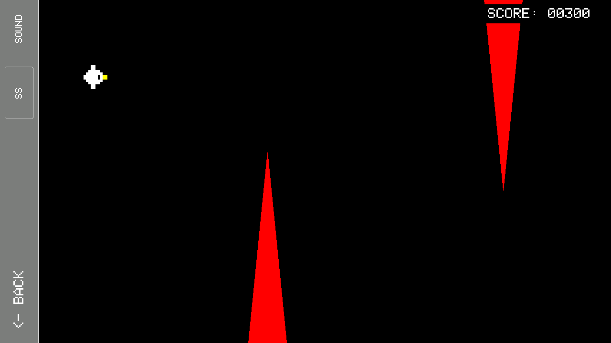
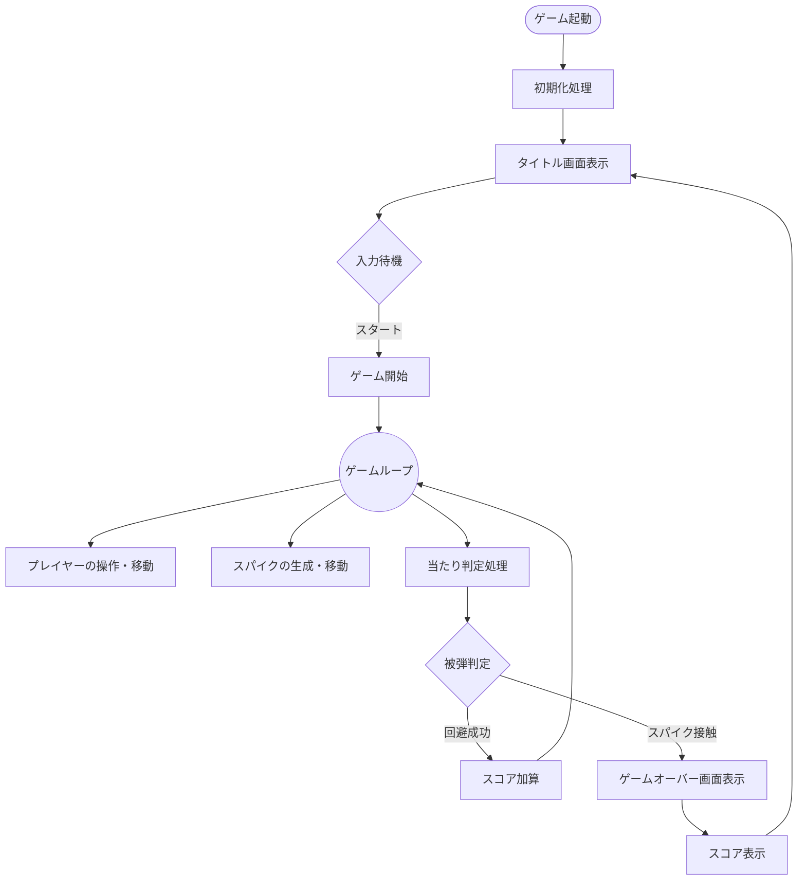

# M5StackTab5-PortableGameDevice

## 概要

本プロジェクトは、Espressif社の最新SoC『ESP32-P4』を搭載した強力な開発ボード『M5Stack Tab5』をベースにしている。このデバイスが持つ高いポテンシャルを最大限に引き出し、独自のポータブルゲーム環境を構築することが目的である。

『主なハードウェア仕様とゲーム機としての利点』
- 『高性能SoC (ESP32-P4)』: デュアルコアRISC-Vアーキテクチャを採用。従来のESP32シリーズよりも演算能力が大幅に向上しており、複雑なゲームロジックの処理にも余裕を持って対応できる。
- 『2Dハードウェアアクセラレーション (PPA)』: 画像処理を補助するハードウェア機構を搭載。CPUの負荷を抑えつつ、滑らかなスプライト描画やアルファブレンドなどのグラフィック表現が可能である。
- 『ディスプレイ性能』: 5インチのIPSタッチスクリーンを搭載。MIPI-DSIインターフェースによる高速転送により、ティアリング（画面のチラつき）のない高フレームレートな描画を実現している。
- 『優れた拡張性』: I2C、SPI、I2Sなど豊富なインターフェースを備えており、物理ボタンの追加や音声出力モジュールなど、ゲーム機に必要な周辺機器を容易に統合できる設計となっている。

## 特徴

- メインメニューからのシームレスなゲーム選択システム
- 『INVADER』: オーソドックスな縦スクロール型シューティングゲーム。敵の弾幕を避けながらハイスコアを目指す。
- 『SPIKE』: デバイスを横持ちに回転させて遊ぶフラップアクションゲーム。画面をタップして鳥をジャンプさせ、迫りくるトゲを避けて進む。
- SDカードからのWAVファイル読み込みによるBGM・効果音の再生機能
- プレイ中の画面をBMP形式でSDカードに保存するスクリーンショット機能
- 画面上部からのミュート(消音)切り替え機能

## 動作環境・依存ライブラリ

- ハードウェア: M5StackTab5
- 開発環境: Arduino IDE
- 依存ライブラリ:
  - M5Unified
  - M5GFX

## 必要なファイル (SDカード)

プログラムを実行する際、SDカードのルートディレクトリに同梱の画像ファイル及び任意のWAVファイルを下記の通りに改名して配置すること。

- `BGM_Menu.wav`:メインメニューのBGM。する
- `SE_INVADE_Laser.wav`：INVADERのレーザー発射SE
- `SE_INVADE_Blast.wav`：INVADERの被弾SE
- `SE_INVADE_Move.wav`：INVADERの敵移動SE
- `BGM_SPIKE.wav`：SPIKEのBGM。ループする
- `SE_SPIKE_Blast.wav`：SPIKEの被弾SE
- `SE_Gameover.wav`：ゲームオーバー時のジングル
- `Rotate.png`：Main内に同梱済み

## 操作方法

基本操作はすべてタッチパネルを利用して行う。

### メインメニュー

- 『INVADER』 / 『SPIKE』 のボタンをタップして各ゲームを起動する。
- 画面上部のトップバーからミュート設定、およびスクリーンショットの撮影が可能。

### INVADER

- 画面下部をタッチ＆スライド: 自機の左右移動
- 画面下部をタップして離す: 弾を発射

### SPIKE

- ゲーム開始時に画面の指示に従い、デバイスを横向きに持ち替える。
- TAP TO START の表示後、画面をタップしてゲーム開始。
- 画面の任意の場所をタップ: プレイヤー(鳥)がジャンプ(上昇)。重力に従って落下するため、タイミングよくタップして障害物を避ける。
- 画面左下(横持ち時の配置)をタップしてメインメニューへ戻る。

## ディレクトリ・ファイル構成

コードの可読性および今後の拡張性を高めるため、機能ごとにファイルを分割して管理している。

- `Main.ino` : システムの初期化、メインループ、メニュー画面UI、音声・画像等の共通処理。
- `Invader.h` / `Invader.cpp` : 『INVADER』のゲームロジックおよび描画処理。
- `Spike.h` / `Spike.cpp` : 『SPIKE』のゲームロジックおよび描画処理.。

## プレイデモ

<video src="https://github.com/SoshiMano/M5StackTab5-PortableGameDevice/blob/main/PlayDemo_Invader.mp4" width="320" height="240" controls></video>

<video src="https://github.com/SoshiMano/M5StackTab5-PortableGameDevice/blob/main/PlayDemo_Spike.mp4" width="320" height="240" controls></video>

